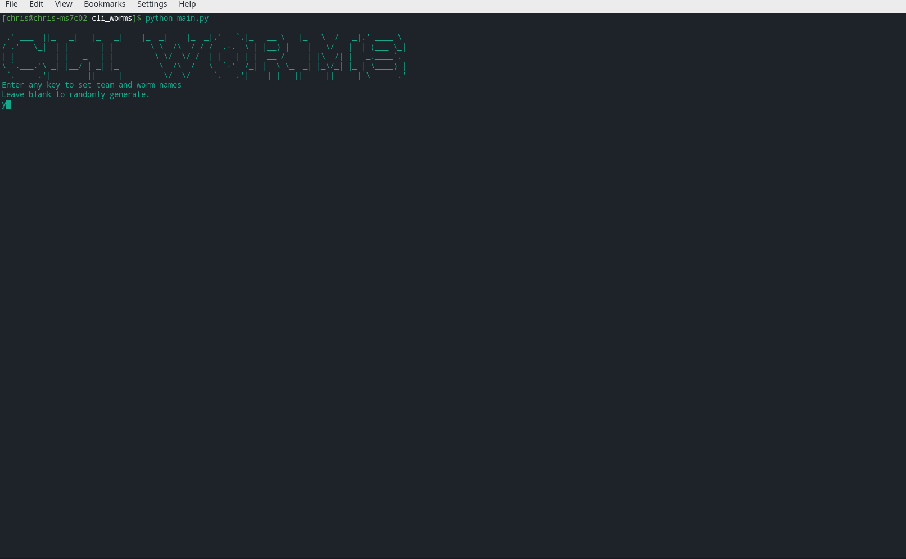
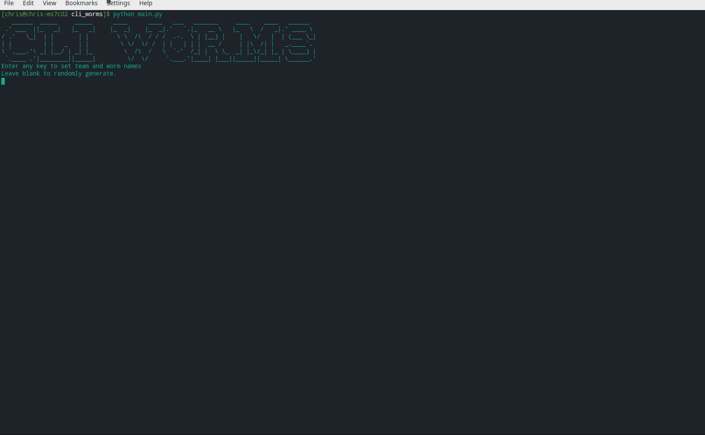
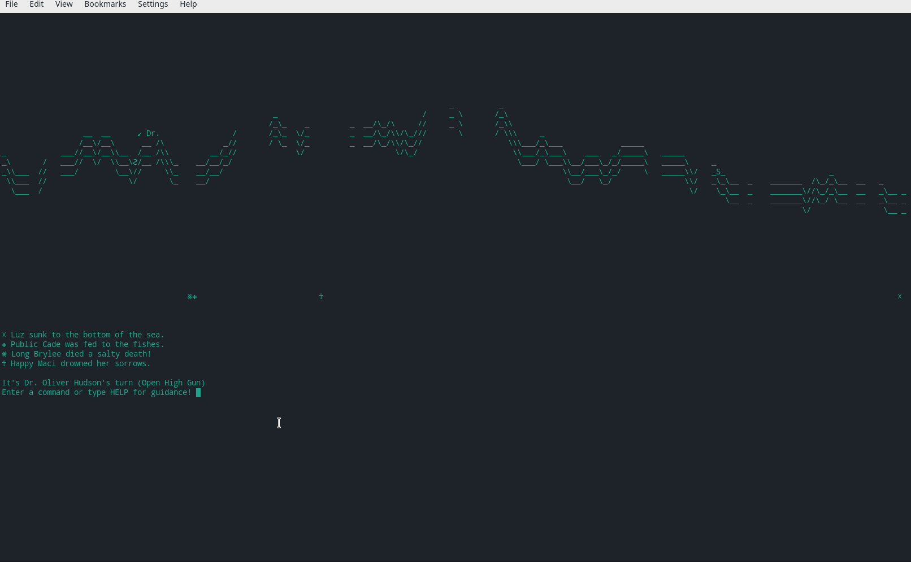
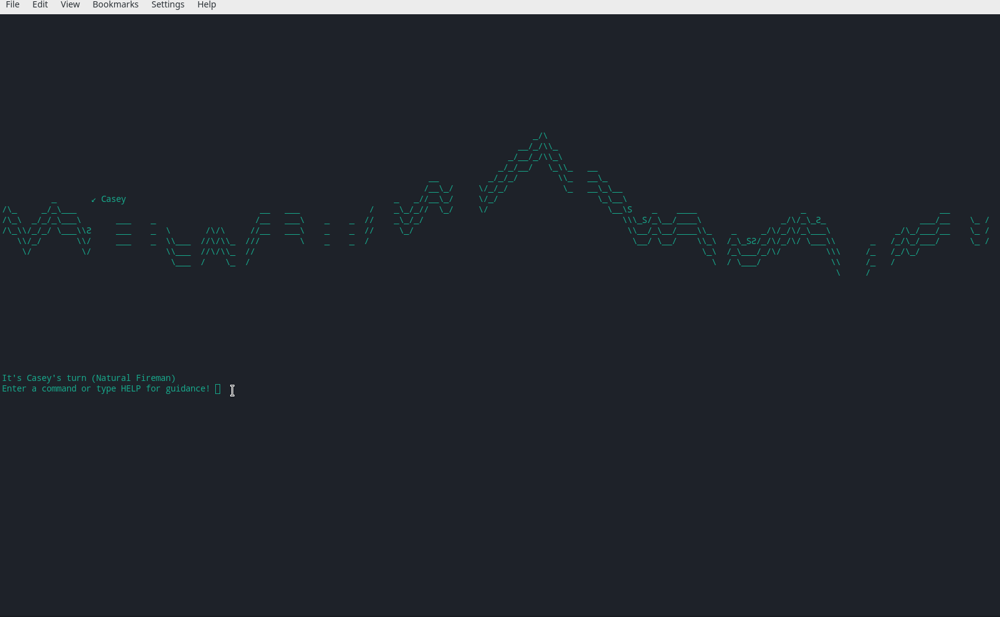
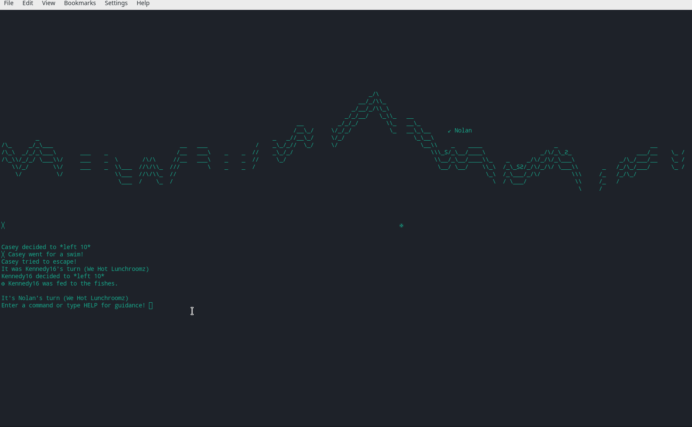
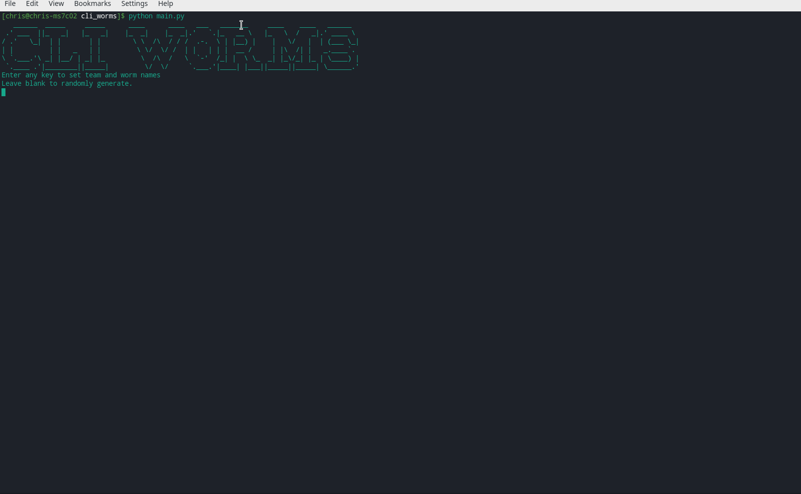
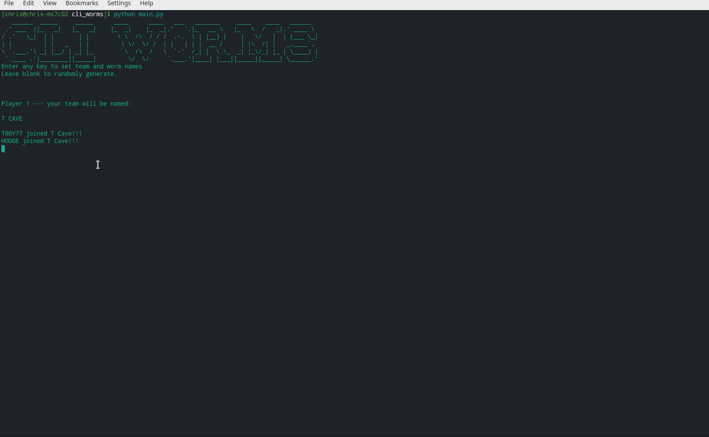

# cli_worms

*A command line interface implementation of Worms - or something.*

## Implemented so far!

### 1. Set team + worm names

### 2. ... or randomly generate team / worm names

### 3. Worms fall into the sea / game ends once a team has no worms left!

### 4. `left` and `right` commands control movement

### 5. `ljump` and `rjump` to jump

### 6. `shoot` to fire an arrow in a given direction

### 7. `mine` to lay a landmine for a given number of frames

## #TODO

### 8. More intelligent frame refresh

Unfortuantely the really doesn't work very well on computers slower than my new build (AMD Ryzen 3600) - need to consider a way to only update certain parts of the frame, e.g. considering which worm is currently under control and which grid coords can be possibly be affected, ignoring those that cannot and just printing them directly (as string rather than chars) from some sort of buffer.

### 9. Damage

At the moment arrows don't do anything - perhaps they should push back enemy worms so you can use this to make them fall into the gaps? Mines also cause no damage - gravity does not seem to be working correctly once the platform underneath a worm disappears.

### 10. A bigger arsenal?

The game is pretty limited using one unicode character per grid pixel so I might choose to keep it simple. Not sure if these constraints will allow for any sort of reasonable implementation of banana bomb, sheep bomb, ninja rope etc.! :D

